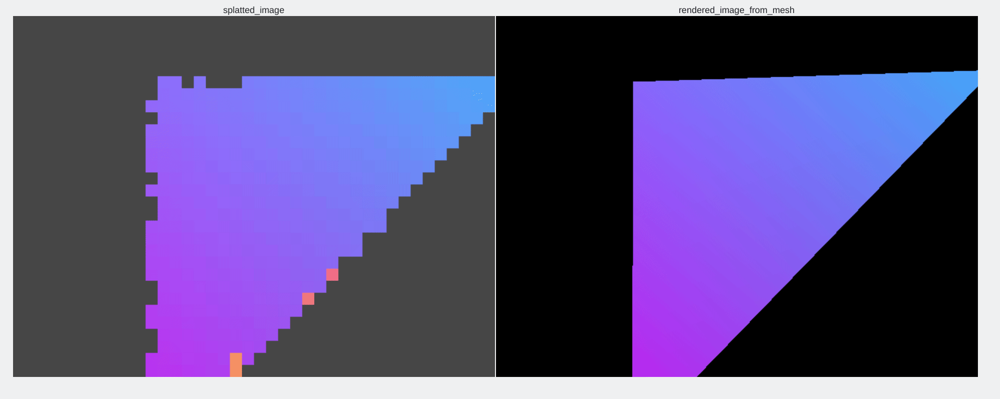
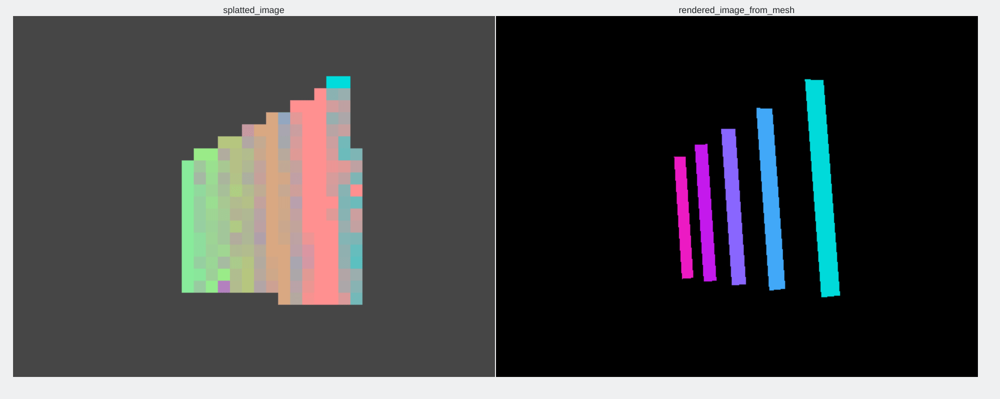
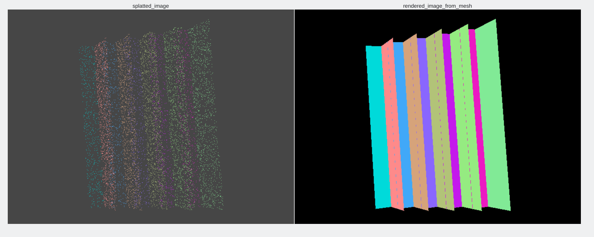
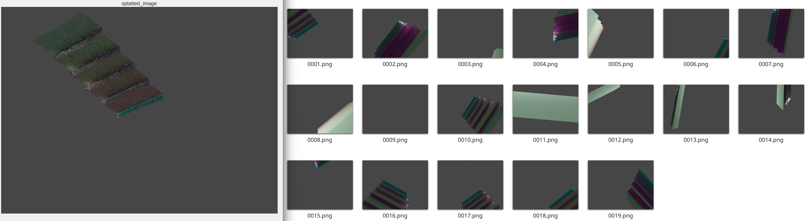

# Per-pixel point rendering
- Program: [MVA Master's degree](https://www.master-mva.com/) class on [3D point clouds](https://www.caor.minesparis.psl.eu/presentation/cours-npm3d/). ENS Paris-Saclay.
- Author of this code: [Balthazar Neveu](https://www.linkedin.com/in/balthazarneveu/)
- Study of [ADOP: Approximate Differentiable One-Pixel Point Rendering](https://arxiv.org/pdf/2110.06635.pdf)

# :scroll: [Report](/report/report.pdf)

This is a point cloud rendering (one pixel rendering) + CNN image processin (=deferred rendering to inpaint the holes between projected points).

| Live inference |
| :---: |
|  |
| using a very tiny CNN (a.k.a Vanilla decoder) 100k points only |


### Setup

Local install of `pixr`

```bash
git clone https://github.com/balthazarneveu/per-pixel-point-rendering.git
cd per-pixel-point-rendering
pip install -r requirements.txt
pip install -e .
```


Run the demo on pre-trained scene,
```bash
python scripts/novel_views_interactive.py -e 55 -t pretrained_scene
```
#### Generating calibrated scenes


- 1/ download and put [NERF's Blender scenes on Google Drive](https://drive.google.com/file/d/1RjwxZCUoPlUgEWIUiuCmMmG0AhuV8A2Q/view?usp=drive_link) in the `__data` folder.
- 2/ get Blender Proc `pip install blenderproc`
- 3/ optional: get a few environment maps textures (e.g. from [PolyHaven](https://polyhaven.com/hdris) ).
- 4/ `python studies/full_render.py -s material_balls -n 4 -m orbit`

```python
if args.scene == "material_balls":
  config = {
      "distance": 4.,
      "altitude": 0.,
      "background_map": "__world_maps/city.exr"
  }
```

#### Code structure
- rendering library:
  - [Per pixel splatting](src/pixr/rendering/splatting.py)
  - [1st pass](src/pixr/rendering/zbuffer_pass.py) (Closest point retrieval = Z-buffer)
  - [2nd pass](src/pixr/rendering/colors_aggregation.py) (Aggregate colors)
  

- synthesis / rasterizer:
  - world definition [with triangle primitives](src/pixr/synthesis/world_simulation.py) or [meshes](src/pixr/synthesis/world_from_mesh.py)
  - [view synthesis of a scene rasterizer](src/pixr/rasterizer/rasterizer_sequential.py)

- learning:
  - [Architectures zoo](src/pixr/learning/architecture.py)
  - Define [experiments](scripts/experiments_definition.py) = scene name, architecture, hyper parameters.
  - `python scripts/optimize_point_based_neural_renderer.py -e 70` after defininng experiment 
- studies:
  - [interactive visualization](studies/interactive_projections.py)
  - [rasterizer check](studies/interactive_rasterizer.py)
  - [differentiability check of splatting](studies/differentiate_forward_project.py) . :warning: so far splatting is not differentiable with regard to camera.


------

#### Tensor convention
##### Images
 `[N, C, H, W]`.
- Image tensors
  - N = number of images in a batch = batch size. ($N<=n$) 
  - C = number of channels (1=luma/depth , 3=rgb or more)
  - H, W spatial dimension
- $n$ is the number of views 

##### Geometry
`[M, p, d]`
- Geometry tensor
  - A primitive is a list of points of size p, p=1 points, p=3 triangles.
  - d=1 for depth d=3 for xyz, 4 xyz1 for homogeneous coordinates
  - M is the number of primitives in a batch. 
- $m$ is the total amount of points.


#### Splatting of points


| Fuzzy depth test (varying $\alpha$ on a scene with two very close triangles) | Normal culling | Multiscale splatting |
| :---: | :---: | :---: |
 |  |  |


#### Non-neuronal point based rendering : Optimizing per point color
To each point of the point cloud, we associate a color vector (*later this vector will have a larger dimension, we get pseudo-colors instead of RGB*).

| Rendered colored point cloud - novel view synthesis| Groundtruth shaded images used to get colors per point so that the final rendering is faithful | 
|:---: | :---: |
|  |  |

#### Using a fuzzy depth test
| Closest point | Fuzzy depth test |
|:---: | :---: |
|  |  |

To reproduce this demo? `python studies/interactive_projections.py -n 200000 -s test_aliasing`.
*Can take some time to sample the point cloud from triangles*